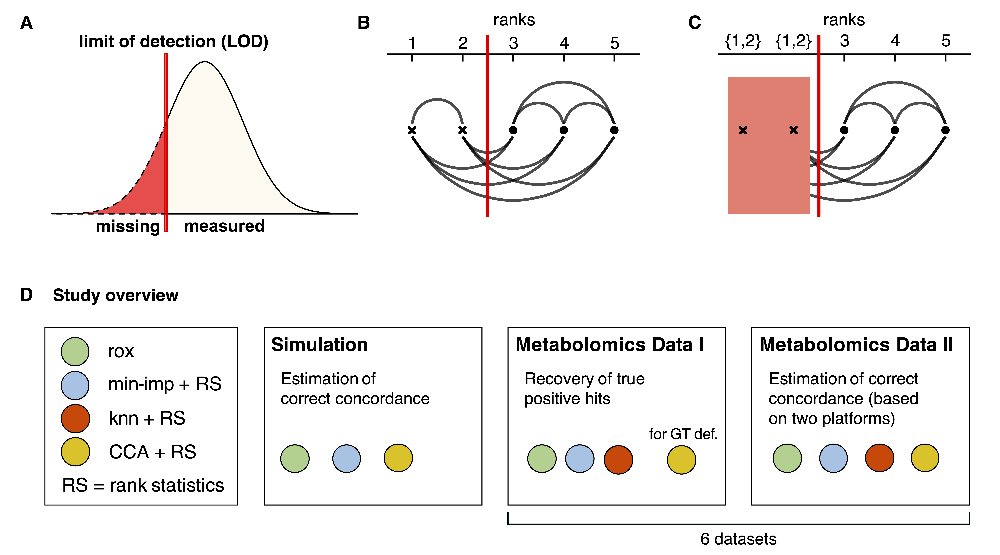

## rox: A statistical model to handle missing values without imputation

 **Limit of detection (LOD)-based missingness, statistical concept, and study overview.** **A:** Schematic of a strict LOD effect on the distribution of a measurement. Values below the LOD (red line) will be reported as missing. **B:** True ordering of data points where every pair of observations can be assigned a relative order. The red line indicates the theoretical LOD. **C:** Observed ordering of data points after LOD censoring. While observations below the LOD (red line) cannot be compared once they are censored, we still retain the information that all points below the LOD are lower than all points above the LOD (blue lines). **D:** Overview of `rox` benchmarking. We assess the performance of our approach using an extensive simulation framework, followed by two test scenarios of ground truth recovery on a series of metabolomics datasets. "for GT def." = used for ground truth definition.

## Citation

This repository contains the R code for Buyukozkan\*, et al., *rox: A statistical model to handle missing values without imputation*. <https://doi.org/xyz/qwa>

## R-package

`/rox` contains the source code of the `rox` R-package. To install from the latest commit:

```{r}
devtools::install_github(repo="krumsieklab/rox", subdir="rox")
```

## Example code

A minimal example explaining how to use `rox` can be found [here](https://github.com/krumsieklab/rox/blob/main/rox/vignettes/minimal_rox.md#minimal-rox-example).


## Data for paper

The following scripts download and preprocess the metabolomics data used in the paper:

-   `data_hc_hits_analysis.R` downloads, preprocesses, and saves 6 metabolomics datasets used for the high-confidence hits analysis in the paper (Figure 4).

-   `data_multiplatform_validation.R` preprocesses the data for  the multi-platform validation analysis (Figure 5).

-   Note: The Excel file from Supplementary Data 1 in the paper needs to be saved as  `multi_platform_validation_supplement.xlsx` in the current working directory.


## Code for paper

`/paper-code/` contains the codes that reproduce the different analysis blocks of the paper:

|                                   | Paper Figure                            |
|-----------------------------------|-----------------------------------------|
| `fig2_simulation_LOD.R`                | Figure 2                                |
| `fig3_simulation_probabilistic_LOD.R`  | Figure 3                                |
| `fig4_main_recovering_hc_hits.R`       | Figure 4                                |
| `fig5_main_multiplatform_validation.R` | Figure 5, Supplementary Figures 4 and 5 |
| `sfig1_simulation_small_sample_size.R`  | Supplementary Figure 1                  |
| `sfig2_simulation_multivariable.R`      | Supplementary Figure 2                  |
| `sfig3_main_cross_lod_estimation.R`     | Supplementary Figure 3                  |
| `stext3_simulation_weighting.R`          | Figure in Supplementary Text 3          |


